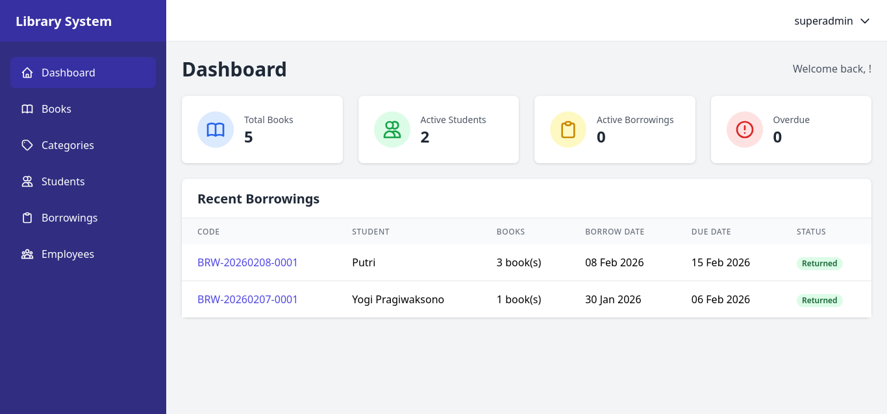
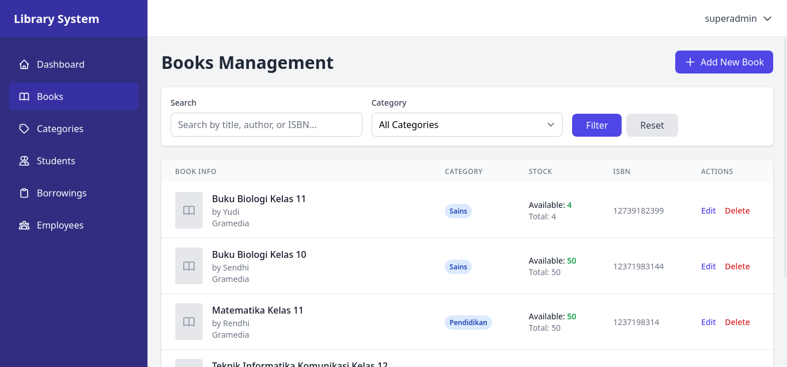
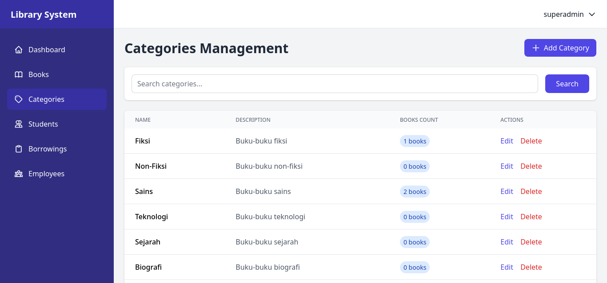
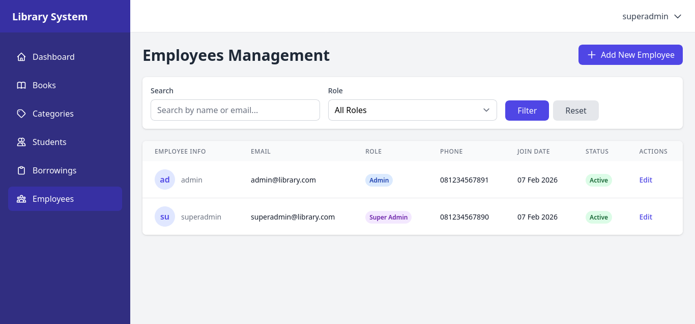
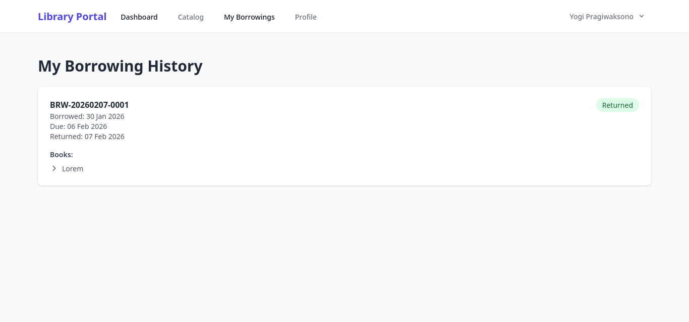
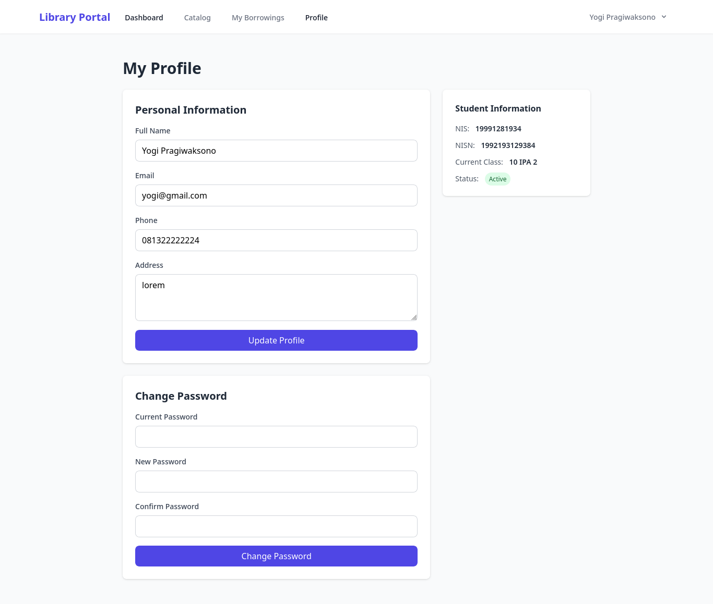

# Medical Record Information System (MRIS)


## 📋 Deskripsi

**Medical Record Information System (MRIS)** adalah Sistem manajemen perpustakaan sekolah dengan Laravel, TailwindCSS, dan AlpineJS.


### ✨ Fitur Utama

- 🏥 **Authentication System**
  - Multi-guard authentication untuk Employee dan Student
  -  Terpisah login untuk admin/superadmin dan siswa
  -  Session-based authentication

- **Employee Features (Admin & Superadmin)**

  - Dashboard dengan statistik perpustakaan
  - Manajemen Buku (CRUD)
  - Manajemen Kategori (CRUD)
  - Manajemen Siswa (CRUD + update status)
  - Manajemen Peminjaman (Create, View, Return)
  - Superadmin: Manajemen Employee (hanya superadmin yang bisa menambah admin)
  - Update profil dan data pribadi

- **Student Features**

  - Dashboard dengan ringkasan peminjaman
  - Catalog buku dengan pencarian dan filter
  - Lihat buku yang sedang dipinjam
  - History peminjaman
  - Update profil dan password
  - Lihat history kelas

- **Book Management**

  - ISBN, judul, penulis, penerbit
  - Kategori buku
  - Stock management (total copies & available copies)
  - Cover image upload
  - Edisi, tahun terbit, jumlah halaman
  - Deskripsi buku

- **Borrowing System**

  - Siswa dapat meminjam multiple books dalam 1 transaksi
  - Tidak bisa meminjam buku yang sama
  - Otomatis cek ketersediaan stock
  - Due date: 7 hari dari tanggal pinjam
  - Auto-generate borrowing code
  - Track status: borrowed, overdue, returned

- **Fine System**

  - Denda otomatis Rp. 500/hari keterlambatan
  - Maximum denda: Rp. 50.000
  - Auto-update denda setiap hari jam 00:00 WIB
  - Console command untuk update denda

- **Student Class History**

  - Track history kelas siswa (10, 11, 12)
  - Nullable untuk kelas yang belum dijalani
  - Academic year tracking

##  🛠️ Tech Stack
  - Backend: Laravel 11.x
  - Frontend: TailwindCSS 3.x
  - JavaScript: AlpineJS 3.x
  - Database: MySQL
  - Authentication: Laravel Multi-Guard

## 🖼️ Screenshots

### Employee Dashboard

*Dashboard dengan statistik lengkap dan grafik*

### Book Management

*Manage data buku*

### Book Form

*Form penambahan buku*

### Categories Management

*Manage data kategori*


### Employee Management

*Manage data pegawai/staff*


### Student Dashboard

*Dashboard siswa*

### Student Catalog

*List buku yang dapat dipinjam siswa*

### History Peminjaman

*Peminjaman yang pernah dilakukan siswa*


### History Borrowings

*Peminjaman yang pernah dilakukan siswa*

### Profile

*Profile*

---

##  Tech Stack

- **Backend**: Laravel 11.x
- **Frontend**: Blade Templates + TailwindCSS
- **Database**: MySQL/MariaDB
- **Authentication**: Laravel Breeze
- **PHP**: 8.2+
- **Package Manager**: Composer, NPM

### Langkah Instalasi

#### 1. Clone Repository
```bash
git clone https://github.com/AnggitSeptiansyah/library-management.git
cd library-management
```

#### 2. Install Dependencies
```bash
# Install PHP dependencies
composer install

# Install JavaScript dependencies
npm install
```

#### 3. Environment Setup
```bash
# Copy file .env
cp .env.example .env

# Generate application key
php artisan key:generate
```

#### 4. Konfigurasi Database

Edit file `.env`:
```env
DB_CONNECTION=mysql
DB_HOST=127.0.0.1
DB_PORT=3306
DB_DATABASE=library_management
DB_USERNAME=your_db_username
DB_PASSWORD=your_password
```

Buat database:
```bash
mysql -u root -p
```
```sql
CREATE DATABASE library_management;
EXIT;
```

## Run Migration and DB Seed
```bash
php artisan migrate

php artisan db:seed
```


## Default Login Credentials
- **Super Admin**
  - Email: superadmin@library.com
  - Password: password

- **Admin**
  - Email: admin@library.com
  - Password: password